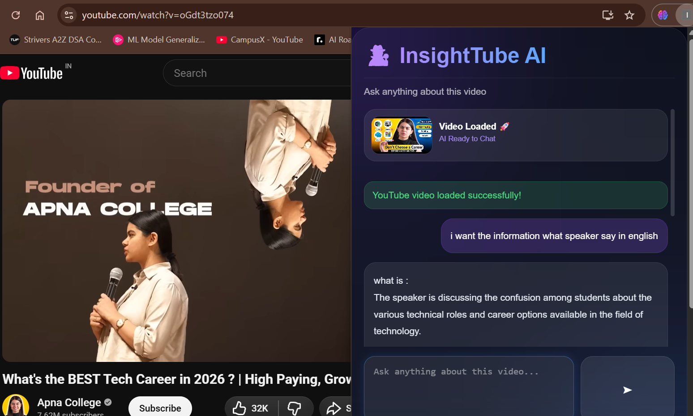
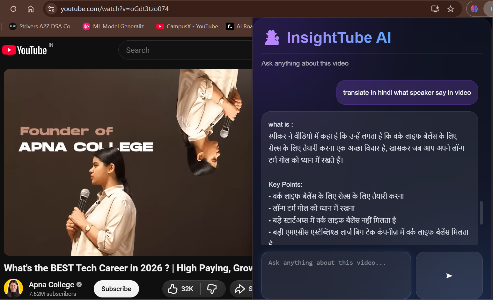

# 🚀 Generative AI Video Assistant using LangChain

An AI-powered YouTube Video Assistant that enables users to interact with any YouTube video through natural language conversations. The system leverages Retrieval-Augmented Generation (RAG) to understand video content, retrieve relevant transcript segments, and generate context-aware responses using Large Language Models.

The application supports multilingual interactions, video summarization, concept explanation, note generation, and transcript translation directly from YouTube videos.

---

# 📌 Problem Statement

YouTube contains an enormous amount of educational and informational content. However, users often face challenges such as:

* Watching lengthy videos to find specific information.
* Difficulty revisiting key concepts discussed earlier.
* Language barriers when videos are in a different language.
* Lack of an interactive mechanism to query video content.
* Time-consuming manual note-taking.

Traditional video platforms provide playback controls but do not allow users to "chat" with the content itself.

---

# 💡 Solution

Generative AI Video Assistant addresses these challenges by converting video transcripts into a searchable knowledge base using semantic embeddings and vector databases.

Users can simply ask questions such as:

* Summarize this video.
* What are the key takeaways?
* Explain this topic in simple terms.
* Translate the speaker's explanation into Hindi.
* Generate interview notes from this video.

The system retrieves the most relevant transcript chunks using FAISS and generates accurate answers using Groq-powered Llama 3 models through LangChain's RAG pipeline.

---

# 🎯 Key Features

### Video Understanding

* Chat with any YouTube video
* Context-aware question answering
* AI-generated summaries
* Key point extraction
* Concept explanation

### Multilingual Support

* English responses
* Hindi translation support
* Multi-language query handling

### Retrieval-Augmented Generation (RAG)

* Transcript chunking
* Semantic embeddings
* Vector similarity search
* Context retrieval
* Hallucination reduction

### Browser Integration

* Chrome Extension support
* Automatic YouTube video detection
* Auto transcript processing
* One-click interaction

### User Experience

* Modern Glassmorphism UI
* Fast response generation
* Real-time interaction
* Responsive design
* YouTube Shorts support

---

# 🏗️ System Architecture

```text
YouTube Video
       │
       ▼
Transcript Extraction
       │
       ▼
Text Chunking
       │
       ▼
HuggingFace Embeddings
       │
       ▼
FAISS Vector Store
       │
       ▼
Relevant Context Retrieval
       │
       ▼
Groq Llama 3
       │
       ▼
AI Generated Response
```

---

# 🧠 Workflow

### Step 1: Video Selection

The Chrome Extension automatically detects the currently opened YouTube video.

### Step 2: Transcript Extraction

The application extracts video transcripts using the YouTube Transcript API.

### Step 3: Text Processing

The transcript is divided into smaller chunks for efficient semantic search.

### Step 4: Embedding Generation

HuggingFace Sentence Transformers convert chunks into vector embeddings.

### Step 5: Vector Storage

Embeddings are stored inside a FAISS vector database.

### Step 6: User Query

The user asks questions related to the video.

### Step 7: Context Retrieval

Relevant transcript chunks are retrieved from FAISS.

### Step 8: Answer Generation

Groq Llama 3 generates a context-aware response based on retrieved information.

---

# 🛠️ Tech Stack

## Frontend

* HTML5
* CSS3
* JavaScript
* Chrome Extension API

## Backend

* Flask
* LangChain
* FAISS
* Groq LLM
* HuggingFace Embeddings
* YouTube Transcript API

## AI & NLP

* Retrieval-Augmented Generation (RAG)
* Sentence Transformers
* Vector Search
* Semantic Retrieval

---

# 📂 Project Structure

```text
Generative-AI-Video-Assistant/
│
├── app.py
├── requirements.txt
├── runtime.txt
├── README.md
├── .env
├── .gitignore
│
├── faiss_index/
│   ├── index.faiss
│   └── index.pkl
│
├── templates/
│   └── index.html
│
├── youtube_extension/
│   ├── manifest.json
│   ├── popup.html
│   ├── popup.js
│   ├── style.css
│   └── icons/
│
└── screenshots/
```

---

# 📸 Application Screenshots

## English Video Interaction



*AI-generated response from YouTube video content in English.*

---

## Hindi Translation Support



*Translation and explanation of video content in Hindi.*

---

# ⚙️ Installation

### Clone Repository

```bash
git clone https://github.com/yourusername/Generative-AI-Video-Assistant.git

cd Generative-AI-Video-Assistant
```

### Create Virtual Environment

```bash
python -m venv myenv
```

### Activate Environment

Windows

```bash
myenv\Scripts\activate
```

Linux / Mac

```bash
source myenv/bin/activate
```

### Install Dependencies

```bash
pip install -r requirements.txt
```

---

# 🔑 Environment Variables

Create a `.env` file

```env
GROQ_API_KEY=YOUR_GROQ_API_KEY
```

---

# ▶️ Run Application

```bash
python app.py
```

Application URL:

```text
http://127.0.0.1:5001
```

---

# 🧩 Load Chrome Extension

1. Open Chrome Browser
2. Navigate to

```text
chrome://extensions/
```

3. Enable Developer Mode
4. Click Load Unpacked
5. Select `youtube_extension` folder

---

# 💬 Example Queries

```text
Summarize this video

What are the key points?

Explain this topic like I'm a beginner.

Translate the speaker's explanation into Hindi.

Generate interview notes.

What does the speaker mean by AI Agents?
```

---

# 📊 Business Impact

This solution helps users:

* Save time while consuming long-form content.
* Learn faster through interactive questioning.
* Access content in multiple languages.
* Create quick notes and summaries.
* Improve educational accessibility.

---

# 🚀 Future Enhancements

* Timestamp-based responses
* Voice-based interaction
* Streaming responses
* Chat history persistence
* Playlist-level chatbot
* PDF notes export
* Multi-video memory
* Mobile application

---

# 🔒 Security

* API keys stored securely using `.env`
* Sensitive files excluded using `.gitignore`
* No hardcoded credentials

---

# 🤝 Contributing

Contributions are welcome.

1. Fork the repository
2. Create a feature branch
3. Commit your changes
4. Submit a pull request

---

# 👨‍💻 Author

**Vaibhavi Patil**

AI/ML Engineer | Generative AI Enthusiast | LangChain Developer

GitHub: `https://github.com/vaibhavipatil0241/Generative-AI-Video-Assistant-using-LangChain`

